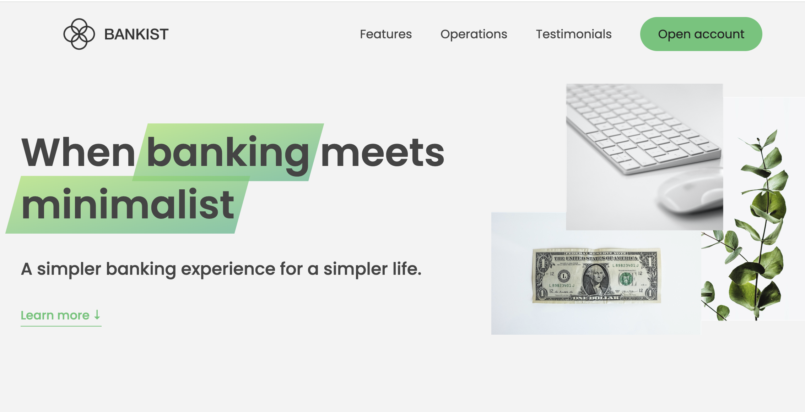

# 💳 Bankist Website

A modern, responsive, and interactive **banking landing page** built using **HTML, CSS, and JavaScript (ES6+)**, simulating a real-world financial product. Developed as part of an advanced JavaScript course, this project demonstrates practical application of core web development concepts with a strong focus on **DOM manipulation**, **event handling**, **performance**, and **user experience**.

## 🧠 What I Learned & Applied

This project served as a hands-on learning experience where I applied:

### 📚 JavaScript (ES6+)

- Advanced **DOM manipulation**:
  - Using `querySelector`, `insertAdjacentHTML`, `getBoundingClientRect`, `scrollIntoView`, `classList`, and `dataset`
- Comprehensive **Event Handling**:
  - Managing event types: `click`, `scroll`, `keydown`, `mouseover`, etc.
  - Implementing `addEventListener`, `removeEventListener`, and **event delegation**
- Understanding **Event Propagation**: bubbling and capturing in real-world scenarios
- Smooth **Page Navigation** using scroll behaviors and link targeting
- Creating a fully functional **Tabbed Component**
- Using the **Intersection Observer API**:
  - Implementing lazy loading for images
  - Creating sticky navigation
  - Revealing sections on scroll with smooth animations
- Writing **clean, modular, and reusable code** patterns
- Building an interactive **Slider Component** with full functionality:
  - Button controls
  - Keyboard navigation
  - Dot navigation

### 💅 HTML & CSS

- Semantic and accessible HTML structure
- Responsive layout using **Flexbox** and **Grid**
- Use of **CSS Custom Properties**
- Smooth transitions and UI animations
- Clean visual hierarchy and spacing

---

## 🚀 Features

- Smooth section scrolling
- Interactive tabbed component
- Section reveal on scroll
- Lazy loading of images
- Sticky navigation
- Modal form for opening an account
- Fully functional content slider with arrows, dots, and keyboard support

---

## 🛠️ Technologies Used

- HTML5
- CSS3 (Custom Properties, Flexbox, Grid)
- JavaScript (ES6+)
- Intersection Observer API
- Git & GitHub

---

## 📸 Preview

---

## 🔗 Links

- **Live Demo:** [Bankist Website](https://hugolomba.github.io/bankist-app/)
- **GitHub Repository:** [github.com/hugolomba/bankist-app](https://github.com/hugolomba/bankist-app)
